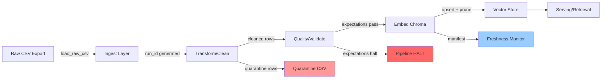

# Kiến trúc pipeline — Lab Day 10

**Nhóm:** Data Quality Team  
**Cập nhật:** 2026-04-15

---

## 1. Sơ đồ luồng (bắt buộc có 1 diagram: Mermaid / ASCII)



**ASCII version:**
```
┌─────────────┐
│ Raw CSV     │ (policy_export_dirty.csv)
└──────┬──────┘
       │ [run_id generated]
       ▼
┌─────────────┐
│ Ingest      │ → log: raw_records
└──────┬──────┘
       │
       ▼
┌─────────────┐
│ Transform   │ → cleaned_records
│ (clean_rows)│ → quarantine_records → artifacts/quarantine/
└──────┬──────┘
       │
       ▼
┌─────────────┐
│ Validate    │ → expectations (9 checks)
│(expectations)│ → halt if severity=halt fails
└──────┬──────┘
       │ [pass]
       ▼
┌─────────────┐
│ Embed       │ → upsert by chunk_id (idempotent)
│ (Chroma)    │ → prune old vectors
└──────┬──────┘
       │
       ▼
┌─────────────┐
│ Manifest    │ → freshness_check (SLA 24h)
│ + Monitor   │ → PASS/WARN/FAIL
└─────────────┘
```

**Điểm đo quan trọng:**
- **run_id**: Generated tại `cmd_run()`, ghi vào mọi log/manifest/artifact
- **freshness**: Đo tại `latest_exported_at` trong manifest (publish boundary)
- **quarantine**: File CSV riêng với `reason` column để audit

---

## 2. Ranh giới trách nhiệm

| Thành phần | Input | Output | Owner nhóm |
|------------|-------|--------|--------------|
| Ingest | `data/raw/*.csv` | List[Dict] rows + `run_id` | Nhóm trưởng (Ingestion Owner) |
| Transform | Raw rows | `cleaned/` CSV + `quarantine/` CSV | Thành viên 2 (Cleaning Owner) |
| Quality | Cleaned rows | ExpectationResult[] + halt flag | Thành viên 2 (Quality Owner) |
| Embed | Cleaned CSV | Chroma collection `day10_kb` | Thành viên 3 (Embed Owner) |
| Monitor | Manifest JSON | Freshness status (PASS/WARN/FAIL) | Nhóm trưởng (Monitoring Owner) |

---

## 3. Idempotency & rerun

**Strategy:** Upsert theo `chunk_id` ổn định

**chunk_id generation:**
```python
def _stable_chunk_id(doc_id: str, chunk_text: str, seq: int) -> str:
    h = hashlib.sha256(f"{doc_id}|{chunk_text}|{seq}".encode("utf-8")).hexdigest()[:16]
    return f"{doc_id}_{seq}_{h}"
```

**Idempotency guarantees:**
1. **Rerun 2 lần không duplicate vectors**: Chroma `upsert()` với cùng `chunk_id` sẽ overwrite
2. **Prune old vectors**: Sau publish, xóa các `chunk_id` không còn trong cleaned set
3. **Deterministic seq**: Sequence number dựa trên thứ tự sau clean (stable sort)

**Test idempotency:**
```bash
python etl_pipeline.py run --run-id test1
# Check vector count
python etl_pipeline.py run --run-id test2
# Vector count should be same (no duplicates)
```

**Log evidence:**
```
embed_prune_removed=3  # Removed 3 old vectors not in current cleaned set
embed_upsert count=7 collection=day10_kb
```

---

## 4. Liên hệ Day 09

**Corpus source:** Cùng domain (CS + IT Helpdesk) nhưng **khác collection**

- **Day 09**: Collection `day09_agent_kb` (nếu có) - dùng cho multi-agent orchestration
- **Day 10**: Collection `day10_kb` - focus vào **data quality layer**

**Shared artifacts:**
- `data/docs/*.txt`: 5 policy documents (refund, SLA, FAQ, HR, access)
- Domain knowledge: refund 7 ngày, P1 SLA 15 phút, lockout 5 lần

**Pipeline này làm gì:**
- Xử lý **export layer** (CSV từ DB/API) trước khi embed
- Đảm bảo **version control** (HR 2026 vs 2025, refund v4 vs v3)
- **Quality gate** trước khi tốn tiền embed

**Integration point:**
- Day 09 agent có thể query `day10_kb` collection sau khi pipeline chạy
- Hoặc: pipeline này là **upstream** feed vào Day 09 corpus

---

## 5. Rủi ro đã biết

| Rủi ro | Impact | Mitigation hiện tại | TODO |
|--------|--------|---------------------|------|
| CSV export thiếu cột | Pipeline crash | Schema validation trong `load_raw_csv` | Thêm expectation check required columns |
| Encoding lỗi (non-UTF8) | Quarantine hoặc corrupt text | Rule 7: detect control chars/BOM | Thêm encoding detection |
| Freshness SLA fail | User thấy data cũ | Monitor log FAIL status | Alert channel chưa setup |
| Duplicate chunk_id | Overwrite nhầm | Expectation E7 check | OK - halt pipeline |
| Vector DB full | Embed fail | Chưa có | Thêm disk space check |
| Concurrent runs | Race condition trên collection | Chưa có lock | Use run_id namespace hoặc staging collection |

**Phát hiện trong Sprint 3 (inject):**
- Khi `--no-refund-fix`: expectation `refund_no_stale_14d_window` FAIL → halt
- Khi `--skip-validate`: embed dữ liệu xấu → eval `hits_forbidden=yes`
